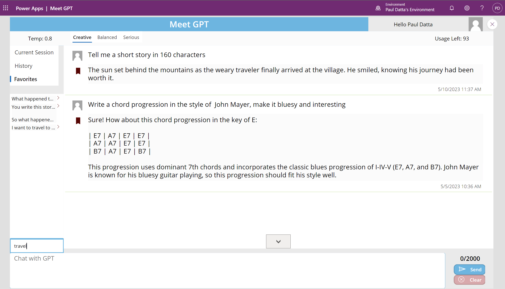
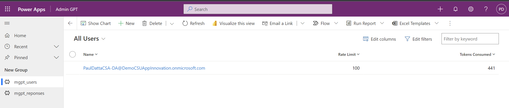

# Meet GPT

Welcome to Meet GPT! This allows business users to experience Azure Open AI Models within their own environment using a PowerApp client.

## Features

- Generates user input responses using Azure Open AI service API
- Stores user data in Dataverse tables for easy analysis
- Admin model driven app to manage user access and rate limits
- More features to come!

  

## Pre-requisites

Before using Meet GPT, please ensure you have the following:

- An Azure Open AI service account with a deployed GPT-3.5 model.
- The OpenAI Key and OpenAI URL for your Azure Open AI service deployment.

If you haven't set up an Azure Open AI service account and deployed the GPT-3.5 model, follow these steps:

1. Sign in to the Azure portal at [https://portal.azure.com](https://portal.azure.com).
2. Create a new Azure Open AI resource. Learn how to create an Azure Open AI resource with this [Microsoft Learn guide](https://docs.microsoft.com/learn/modules/get-started-with-azure-ai-text-api/).
3. Follow the instructions to deploy the GPT-3.5 model within your Azure Open AI service. Refer to the [Microsoft Learn guide](https://docs.microsoft.com/learn/modules/deploy-language-model-with-text-api/) for detailed steps on deploying the GPT-3.5 model.

Retrieve the OpenAI Key and OpenAI URL from your Azure Open AI service account.

## Usage

To use Meet GPT, follow these steps:

1. Deploy the app to your PowerPlatform environment by importing the PowerPlatform solution in the ./latest folder. You can learn how to import a PowerPlatform solution by following the steps in this [Microsoft Learn guide](https://docs.microsoft.com/learn/modules/import-solutions/).
2. Set the `OpenAI_Key` and `OpenAI_URL` environment variables to the appropriate values for your Azure Open AI service deployment.
Use the entire OpenAI URL including the deployment name and API version

4. The `mgpt_getResponse` flow communicates with the Azure Open AI service deployment API.

## Changelog

- **Version 1.0.0.7:**
  - New Feature - Favorites, added a flow and UI
  - UI changes, improved layout and design
  - Added tabs for current session, history and favorites, Prompt search
- **Version 1.0.0.6:**
  - Added an admin model driven app, still WIP but you can change rate limits
  - Added soft rate limits where
    - Value of `-1` : Unlimited API calls
    - Value of `0` : Cant make any API calls
    - Value > `0`: Number of API calls, so a user with Rate Limit set to 100 can press `send` a 100 times
  - Updated the Flow to track limits and also calculate tokens sent
  - Updated the UI to show the rate limit with no enforcement
  - New users get added to the User's table automatically with a default Rate Limit of 100. 
- **Version 1.0.0.5:**
  - UI changes, improved layout and design
  - Fixed GalleryChat message loading filters, clear and submit action datasource refresh
- **Version 1.0.0.4:**
  - UI changes, removed unused screens
  - Only list interactions from today, clear now resets the gallery
  - Canvas app is now version controlled, check the `canvas` branch
- **Version 1.0.0.3:**
  - Fixing the missing/blank app issue. 
- **Version 1.0.0.2:**
  - Removed an unused HTTP with Azure AD connector from the solution. 
- **Version 1.0.0.1:**
  - This app lets you send prompts to Azure Open AI and adjust temperature settings through a user-friendly interface.
  - Created in a fast and fun hackathon mode in just 4 hours.

**Known Bugs:**

- Gallery view and UI design are being improved.
- Message send/chat flow is being improved.
- Has not been tested enough to be production ready.

## Roadmap
- [&#x2713;] Admin section to manage user access and token/rate limits
- [&#x2713;] User Favorites with search
- [WIP] Workflow for users to request more tokens with simple gamification
- [Planned] Prompt analysis, for admin to monitor user activity and feedback
- [Planned] Submit an idea section for business users to share AI use cases for their work
- [Planned] Advanced mode for users to send custom prompts and export JSON etc like Azure Open AI Studio
- [Planned] Add a datasource (experimental, might start with SPO/OneDrive) and Q&A

## Contributing

If you would like to contribute to Meet GPT, please follow these guidelines:

1. Fork the repository and create a new branch for your changes.
2. Make your changes and test them thoroughly.
3. Export your PowerPlatform solution as a zip file.
4. Submit a pull request with a detailed description of your changes and why they are needed, including the exported PowerPlatform solution zip file.
5. Wait for feedback and address any issues that are raised.

## Microsoft Open Source Code of Conduct

This project has adopted the [Microsoft Open Source Code of Conduct](https://opensource.microsoft.com/codeofconduct/).

Resources:

- [Microsoft Open Source Code of Conduct](https://opensource.microsoft.com/codeofconduct/)
- [Microsoft Code of Conduct FAQ](https://opensource.microsoft.com/codeofconduct/faq/)
- Contact [opencode@microsoft.com](mailto:opencode@microsoft.com) with questions or concerns

## Contact

If you have any questions or encounter any issues with Meet GPT, please create an issue.

## Acknowledgements

Meet GPT utilizes the following technologies and resources:

- PowerPlatform
- Azure Open AI Service

Special thanks to David E for his valuable ideas and feedback.